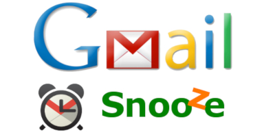

### What it was

Back in 2014, Google released a new email tool called [Inbox](https://www.google.com/inbox). It was so awesome. It introduced email bundling,built-in tasks/reminders, and most of all, official support for snoozing messages. 

However, the G-Suite instance we had configured at work didn't have access to Inbox. And every day, I received at least one email that made me say, "I wish I could snooze this for a few days." And because IMAP access was blocked, a third-party snoozing extension wasn't an option, either.

Fortunately, Google published a very basic snoozing snoozing feature via a Google Apps Script [on their blog](http://googleappsdeveloper.blogspot.com/2011/07/gmail-snooze-with-apps-script.html) a few years back. It didn't take long to customize it, add a bunch of configuration, a UI, and publish it as a web app.

### How it worked

1. The app creates a snoozed message label for each day.
1. You snooze messages by moving them to the label for the number of days you want to snooze.
1. Each day at the time you specify, the app promotes snoozed messages down one snooze day until it is time to move it back to your inbox. If configured to do so, the app will mark the message as unread and apply an "unsnoozed" label to remind you that you snoozed it.

I wrote a web UI layer on top of it, added a configuration page, and bundled it as a Chrome app [in the Chrome webstore](https://chrome.google.com/webstore/detail/gmailsnooze/alpijhhgggjdfchmlhofhifceddjdlaf).

It enjoyed some success for a few years among the userbase who couldn't or didn't want to use Inbox. Eventually I was approached by the folks behind the [SendLatr Gmail extension](https://chrome.google.com/webstore/detail/sndlatr-for-gmail/nfddgbpdnaeliohhkbdbcmenpnkepkgn) with an offer to buy. They own the product now, and all questions, comments, and feedback should be directed to [Nathan Latka](http://nathanlatka.com/) and his team.

### UPDATE

Gmail added official snoozing support directly into Gmail in 2018 and deprecated Inbox with an end-of-life date of 2019. Good on Google for building this feature into Gmail.
